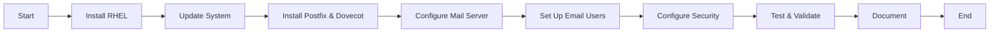

# Configuring a Mail Server on Red Hat Enterprise Linux (RHEL)

## Objective

The objective of this project is to set up a reliable and secure mail server on Red Hat Enterprise Linux 
(RHEL). This mail server will handle email sending, receiving, and management using Postfix and Dovecot as 
the main components. The configuration will also include setting up spam filters, encryption, and user 
management.



## Project Overview

1.  **Planning and Preparation**
    
    -   Define requirements and objectives.
    -   Set up RHEL environment.
    -   Choose and install necessary packages.
2.  **Mail Server Configuration**
    
    -   Install and configure Postfix (SMTP server).
    -   Install and configure Dovecot (IMAP/POP3 server).
    -   Set up email domains and users.
    -   Configure spam filters and antivirus.
3.  **Security and Optimization**
    
    -   Implement SSL/TLS encryption.
    -   Configure firewall and SELinux policies.
    -   Optimize server performance.
4.  **Testing and Validation**
    
    -   Test email sending and receiving.
    -   Validate spam filter effectiveness.
    -   Perform security and performance testing.
5.  **Documentation and Conclusion**
    
    -   Document the configuration steps and any issues faced.
    -   Evaluate the benefits, challenges, and overall performance.

## Step-by-Step Configuration

### 1. Planning and Preparation

-   **Install RHEL**: Ensure RHEL is installed and updated.
-   **Update System**:

```bash
sudo yum update -y
```

### 2. Mail Server Configuration

-   **Install Postfix**:

```bash
sudo yum install postfix -y
sudo systemctl enable postfix
sudo systemctl start postfix
```


- **Configure Postfix**: Edit `/etc/postfix/main.cf` to set the following parameters:
```bash
myhostname = mail.example.com
mydomain = example.com
myorigin = $mydomain
inet_interfaces = all
mydestination = $myhostname, localhost.$mydomain, localhost, $mydomain
```

- **Install Dovecot**:
```bash
sudo yum install dovecot -y
sudo systemctl enable dovecot
sudo systemctl start dovecot
```

- **Configure Dovecot**: Edit `/etc/dovecot/dovecot.conf` and set the following parameters:

```bash
mail_location = maildir:~/Maildir
service auth {
  unix_listener /var/spool/postfix/private/auth {
    mode = 0660
    user = postfix
    group = postfix
  }
}
```

- **Set Up Email Domains and Users**: Create email users and configure domains as needed.

```bash
sudo useradd -m user1
sudo passwd user1
```

- **Configure Spam Filters**: Install and configure SpamAssassin:
```bash
sudo yum install spamassassin -y
sudo systemctl enable spamassassin
sudo systemctl start spamassassin
```
Edit `/etc/mail/spamassassin/local.cf` to adjust spam filtering rules.

**Configure Antivirus**: Install ClamAV:

```bash
sudo yum install clamav clamav-update -y
sudo freshclam
sudo systemctl enable clamd@scan
sudo systemctl start clamd@scan
```

### 3. Security and Optimization

-   **Implement SSL/TLS Encryption**: Obtain and install SSL certificates and configure Postfix and 
Dovecot to use them.
-   **Configure Firewall**: Allow necessary ports (25 for SMTP, 143/993 for IMAP):

```bash
sudo firewall-cmd --permanent --add-service=smtp
sudo firewall-cmd --permanent --add-service=imap
sudo firewall-cmd --reload
```

**Configure SELinux**: Set SELinux policies to allow mail server operations.

```bash
sudo setsebool -P httpd_can_network_connect 1
```

### 4. Testing and Validation

-   **Test Email**: Use tools like `telnet` or `swaks` to send and receive test emails.
-   **Validate Spam Filter**: Send test emails with spam characteristics to ensure proper filtering.
-   **Perform Security and Performance Testing**: Check server logs and use performance monitoring tools.

### 5. Documentation and Conclusion

-   Document the entire configuration process.
-   Assess the benefits, such as secure email communication and efficient spam filtering.
-   Identify challenges, like troubleshooting mail delivery issues or spam filter configurations.
---
## Benefits

-   **Enhanced Security**: Secure communication through SSL/TLS and spam filtering.
-   **Reliable Email Management**: Efficient handling of email traffic.
-   **Customization**: Tailor configurations to specific needs.

## Challenges

-   **Configuration Complexity**: Setting up and tuning Postfix and Dovecot can be complex.
-   **Security Management**: Ensuring ongoing security and handling vulnerabilities.
-   **Performance Tuning**: Optimizing for performance and handling large volumes of email.

